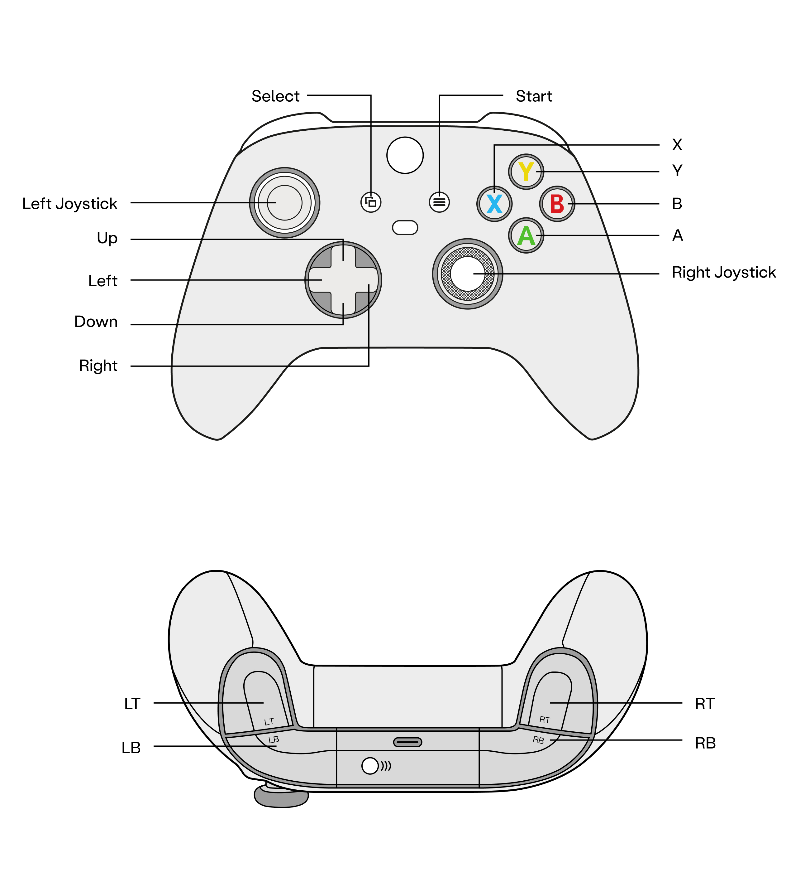
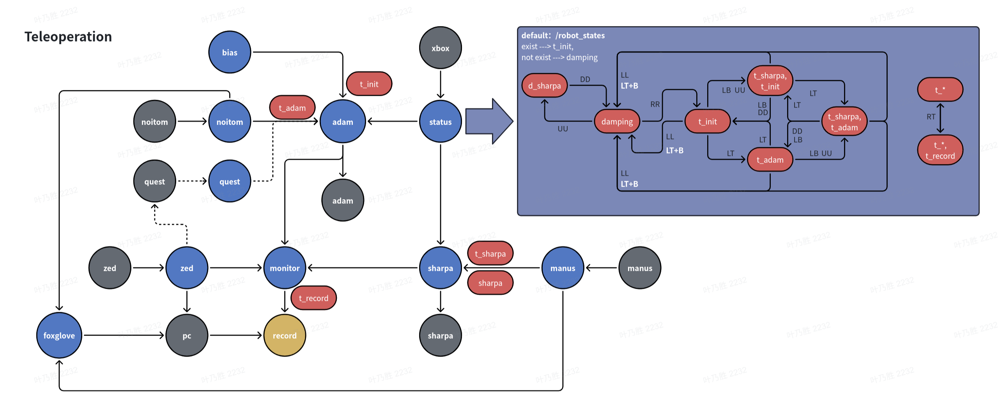
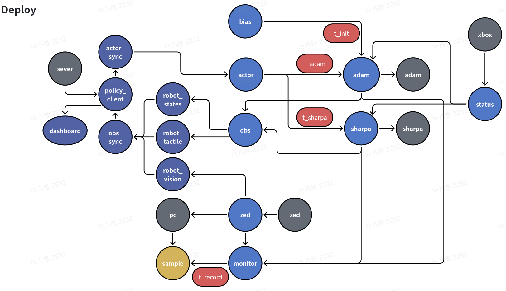

# PND SHARPA Teleop / 数采 / Deploy

Adam Pro + SharpA Wave 的 ROS 2 Humble 遥操与模型部署。系统分为三个本体，跨机器只走 TCP、RTP 和 WebSocket，不依赖跨机器 ROS DDS discovery。Server deploy 源码由 DreamZero 仓库的 `scripts/deploy/<model>` 维护，Workstation 不再向 Server 复制旧部署脚本。

| 本体 | 默认路径 | 职责 |
| --- | --- | --- |
| PND | `/home/pnd-humanoid/Deploy` | 机器人、手、相机、遥操及 action/obs 网关 |
| Workstation | `/home/ps/Deploy-v2/pnd-sharpa` | obs 同步、策略客户端、IK、动作调度和 dashboard |
| Server | `/share/project/yenaisheng/dreamzero` | 模型运行环境、checkpoint registry 与各模型 deploy 入口 |

## 1. Setup

首次安装各本体；已安装环境只需要更新和重新编译有改动的一端。

```bash
# PND
cd /home/pnd-humanoid
git clone https://github.com/OpenDriveLab/PND-Sharpa-Teleop.git Deploy
cd Deploy && ./build.sh

# Workstation
cd /home/ps
git clone https://github.com/OpenDriveLab/PND-Sharpa-Teleop.git Deploy
cd Deploy && conda activate pnd-ws-ros && ./build_workstation.sh

# Server deploy：代码由 DreamZero repo 维护，只检查部署入口是否存在
ssh BAAI2 \
  'test -f /share/project/yenaisheng/dreamzero/scripts/deploy/training_registry.json'
```

### 外部 SDK 资产

以下资产被 Git 忽略，新机器需要单独下载。所有下载源都指向公开 GitHub Release 或官方页面，可直接在浏览器打开：

| 资产 | 版本 | 下载源 | 放置目录 |
| --- | --- | --- | --- |
| SharpA Wave SDK | 5.0.2 | [sharpa-wave-sdk_5.0.2_amd64.deb](https://github.com/sharpa-robotics/sharpa-wave-sdk/releases/download/v5.0.2/sharpa-wave-sdk_5.0.2_amd64.deb) | `external/sharpa_control/sdk/sharpa-wave-sdk/`（或 `sudo dpkg -i`） |
| SharpA Pilot | 2.0.2 | [sharpa-pilot releases](https://github.com/sharpa-robotics/sharpa-pilot/releases) | `sudo dpkg -i sharpa-pilot_2.0.2_amd64.deb` |
| SharpA Manus SDK | V1.0.1 | [sharpa-manus-sdk_release.tar.gz](https://github.com/sharpa-robotics/sharpa-manus-sdk/releases/download/V1.0.1/sharpa-manus-sdk_release.tar.gz) | `external/sharpa_control/sdk/sharpa-manus-sdk/` |
| Noitom + Adam Retarget | v0.8.0 | [pnd-teleop-amd64.tar.gz](https://github.com/pndbotics/pnd_teleoperation/releases/download/v0.8.0/pnd-teleop-amd64.tar.gz) | `src/noitom_node/vendor/` |
| PND lowstate DDS | — | 机器出厂预装 | 无需下载 |
| NX ZED pipeline | dev_pnd | [zed-sdk dev_pnd 分支](https://gitee.com/clvhao/zed-sdk/repository/archive/dev_pnd.zip) | NX：`/home/pnd-humanoid/Documents/pnd_teleoperation/external/pnd-gst-webrtc/` |
| GStreamer WebRTC JS | 3.0.0 | [@tomoxv/gstwebrtc-api](https://www.npmjs.com/package/@tomoxv/gstwebrtc-api) | `src/zed_node/web/gstwebrtc-api-3.0.0.esm.js` |
| Foxglove Studio | — | [foxglove.dev/download](https://foxglove.dev/download) | AppImage，Workstation |

或直接使用 PND 一键安装脚本（包含 Noitom 和 Adam Retarget）：

```bash
curl -fsSL https://raw.githubusercontent.com/pndbotics/pnd_teleoperation/refs/heads/main/install.sh | bash
source /opt/pnd/pnd_teleop/install/setup.bash
```

解压 / 安装后至少确认以下路径存在：

```text
external/sharpa_control/sdk/sharpa-wave-sdk/{python,lib,include,config.yaml}
external/sharpa_control/sdk/sharpa-wave-sdk/config/tactile.json
external/sharpa_control/sdk/sharpa-manus-sdk/client/SharpaManusClient.out
external/sharpa_control/sdk/sharpa-manus-sdk/client/ManusSDK/lib/
external/sharpa_control/sdk/sharpa-manus-sdk/retargeting_alg_release_V4.0/
src/noitom_node/vendor/bin/{noitom_mocap,adam_retarget}
src/noitom_node/vendor/lib/noitom_mocap/libMocapApi.so
/home/pnd-humanoid/Documents/pnd_teleoperation/external/pnd-gst-webrtc/thirdparty/bin/gst-launch-1.0
```

PND 公开的 NX sender 可用于参考 ZED 采集，但当前 `zed_node` 启动的是定制 `pnd-gst-webrtc` GStreamer 目录；该完整目录没有独立公开 release，新机器人应从交付时的 NX 环境或 PND 内部归档迁移。指南中的 `zed_stream_local20.zip` 是旧 Windows 预览程序，不是当前 Quest Link 客户端依赖。

Workstation 的 FK/IK 模型随本仓库的 `adam_sharpa_description` 安装，不依赖 `deploy-legacy` 或外部 MuJoCo 资产。

### 加载 ROS 环境与 Xbox 按键约定

每次进入 PND shell 可先加载：

```bash
source /opt/ros/humble/setup.bash
source /home/pnd-humanoid/.cache/pnd_ros2/cyclonedds_ws/install/setup.bash
source /home/pnd-humanoid/Deploy/install/setup.bash
```

Xbox 按键约定




## 2. Teleop



### 完整遥操

Noitom 和 Quest 共用 `teleoperation.launch.py`，只通过 `teleop_source:=noitom|quest` 选择 Adam 上半身输入源。切换输入源需要重启 launch。

#### Noitom Windows 配置

在 Windows Axis Studio 中完成传感器连接、角色绑定和姿态校准，然后打开 BVH broadcasting（windows 有线连接 noitom，ip 设置为 `10.42.0.xx`，如 `10.42.0.21`，子网掩码为 `255.255.255.0`）：

- Protocol 选择 `UDP`，目标地址填写 PND `10.10.20.127`，端口填写 `7012`。
- BVH data 选择 `Binary`，rotation order 选择 `YXZ`。
- 启用 `Transformation/Displacement`，开始 broadcast 后保持 Axis Studio 运行。
- Windows 与 PND 必须处于同一 `10.10.20.x` 网络，Windows 防火墙需允许 Axis Studio 发送 UDP。PND 的 `noitom_mocap` 固定监听 UDP `7012`。

#### Quest Windows 配置

Quest 正式链路使用 USB Meta Quest Link，不需要浏览器或 SteamVR：

1. Windows 安装 Meta Quest Link 和 .NET 8 SDK x64，并将 Meta Quest Link 设置为当前 OpenXR runtime。
2. 将 `src/quest_node/windows/native` 整个目录复制到 Windows，例如 `C:\Users\baai\Desktop\PNDQuestTeleop`。
3. 在 Windows `cmd` 中编译并检查：

   ```cmd
   cd C:\Users\baai\Desktop\PNDQuestTeleop
   dotnet restore
   dotnet publish -c Release -r win-x64 --self-contained true -p:PublishSingleFile=false -o publish
   Start-PNDQuestTeleop.cmd --check
   ```

4. 使用 USB 3 连接 Quest，进入 Quest Link 后，从 Windows 登录桌面运行 `Start-PNDQuestTeleop.cmd`。OpenXR 程序不能通过 SSH 或 Windows service 启动。

5. 启动之后，按下 quest 右手柄的 A 键标定。

6. 如需在 Windows 桌面查看 Quest Link 头显画面，运行：

   ```cmd
   "%ProgramFiles%\Oculus\Support\oculus-diagnostics\OculusMirror.exe"
   ```

   `OculusMirror` 只用于桌面镜像查看，不参与 tracking、ZED 视频或 ROS 数据传输。

默认 PND 为 `10.10.20.127`、ZED 为 `10.10.20.126:5602`。网络变化时，在运行脚本前设置 `PND_QUEST_ROS_HOST`、`PND_QUEST_ZED_HOST`、`PND_QUEST_ZED_PORT`，无需修改或重新编译 C#。完整说明见 `src/quest_node/README.md`。

#### 统一启动命令

先用 Xbox 单击 `A` 进入零位，再单击 `X` 进入站立模式。PND 运行：

```bash
# 以下命令二选一

# Noitom 动捕服为输入源
# Noitom 默认使用 `noitom_retarget_backend:=pinocchio`。可选 `mink` 和 `gmr`，但仅作为开发保留。
sudo -E bash -lc '
cd /home/pnd-humanoid/Deploy
source /opt/ros/humble/setup.bash
source /home/pnd-humanoid/.cache/pnd_ros2/cyclonedds_ws/install/setup.bash
source /opt/pnd/pnd_teleop/install/setup.bash
source install/setup.bash
export RMW_IMPLEMENTATION=rmw_fastrtps_cpp
export ROS_LOCALHOST_ONLY=1
exec ros2 launch teleoperation teleoperation.launch.py \
  mode:=teleop teleop_source:=noitom \
  start_manus:=true start_sharpa:=true \
  recording_root:=/mnt/t9/recordings
'

# Quest3S 为输入源
# Quest 默认使用头显朝向控制 `neckYaw` 和 `neckPitch`。这里固定颈部，启动参数 `quest_enable_neck:=false`
# `quest_retarget_method` 三种模式：
#   - nonlinear_ik：非线性全局 IK，默认使用，参考 unitree_xr retarget
#   - shoulder_prior：双腕目标 + 肩部姿态软先验，参考 pnd quest retarget
#   - local_qp：局部速度级 QP IK，参考 trex retarget，谨慎使用
sudo -E bash -lc '
cd /home/pnd-humanoid/Deploy
source /opt/ros/humble/setup.bash
source /home/pnd-humanoid/.cache/pnd_ros2/cyclonedds_ws/install/setup.bash
source /opt/pnd/pnd_teleop/install/setup.bash
source install/setup.bash
export RMW_IMPLEMENTATION=rmw_fastrtps_cpp
export ROS_LOCALHOST_ONLY=1
exec ros2 launch teleoperation teleoperation.launch.py \
  mode:=teleop teleop_source:=quest \
  quest_retarget_method:=nonlinear_ik \
  quest_enable_neck:=false \
  start_manus:=true start_sharpa:=true \
  recording_root:=/mnt/t9/recordings
'
```

两条命令都会默认启动 Manus 手套、SharpA 驱动、Bias、Status、Adam、ZED、Monitor 和 Foxglove；`teleop_source` 只选择 Adam 上半身使用 Noitom 还是 Quest。仅在不使用手套时传入 `start_manus:=false`。切换 `quest_retarget_method` 后需要重启 launch，并重新按右手柄 A 标定。

若按下 Quest 右手柄 A 后 Foxglove 仍不动，先检查 `/quest/webvr_status` 中 `calibrated` 是否为 `false`。OpenXR 未上报 A 键时，可保持头部和双手柄定位有效并运行：

```bash
ros2 service call /quest/calibrate std_srvs/srv/Trigger {}
```

启动后的 Xbox 操作：

1. 单击 `Right`，进入遥操模式。
2. 单击 `LB`，打开或关闭 Manus-SharpA 遥操通道。
3. 单击 `LT`，打开或关闭 PND-Adam 上肢遥操通道。
4. 单击 `RT`，开始或结束数据记录。
5. 同时按 `LT`、`B`，从遥操退出到阻尼模式。
6. 可选：同时按 `LB`、`RB` 使 Adam 关节下电；同时按 `Y`、`B` 重新上电。
7. Adam 重新上下电后，在终端运行"重启 DDS 服务"命令。

#### 查看部署状态

启动后另开一个 PND 终端查看当前控制状态：

```bash
sudo -E bash -lc '
source /opt/ros/humble/setup.bash
source /home/pnd-humanoid/.cache/pnd_ros2/cyclonedds_ws/install/setup.bash
source /home/pnd-humanoid/Deploy/install/setup.bash
export ROS_LOCALHOST_ONLY=1
unset ROS2CLI_NO_DAEMON
ros2 daemon stop >/dev/null 2>&1 || true
ros2 daemon start >/dev/null

ros2 topic echo --once /control_status --field data \
  --qos-durability transient_local --qos-reliability reliable
ros2 topic echo --once /sharpa_physical_tactile_status --field data
'
```

### 遥操页面

EgoView 和 Bias Set 只监听 PND 本机，ip 为 `https://10.10.20.127`。

| 页面 | 打开方式 |
| --- | --- |
| EgoView | Workstation 浏览器打开 `https://10.10.20.127/egoview` |
| Bias Set | Workstation 浏览器打开 `https://10.10.20.127/bias_joints` |
| Foxglove | Foxglove 选择 `Open connection` → `Foxglove WebSocket`，连接 `ws://10.10.20.127:8765` |

Foxglove 第一次连接时，添加一个 `3D` panel，打开该 panel 的 settings，将 `src/foxglove_node/config/noitom_scene_panel.json` 中的完整 JSON 粘贴或导入 panel config。该配置设置 `world` follow frame、相机、地面网格、Z-up 和 `/robot_description`；保存 Foxglove layout 后，后续启动不需要重新配置。

### 停止遥操 ROS

```bash
# 遥操：优先在 launch 终端 Ctrl-C；终端丢失时停止全部旧 launch 进程组
sudo bash -c '
mapfile -t pids < <(pgrep -f "^/usr/bin/python3 /opt/ros/humble/bin/ros2 launch teleoperation teleoperation\\.launch\\.py( |$)")
pgids=()
for pid in "${pids[@]}"; do pgids+=("$(ps -o pgid= -p "$pid" | tr -d " ")"); done
for pgid in "${pgids[@]}"; do kill -CONT -- "-$pgid"; kill -INT -- "-$pgid"; done
sleep 5
for pgid in "${pgids[@]}"; do
  kill -0 -- "-$pgid" 2>/dev/null && { kill -CONT -- "-$pgid"; kill -TERM -- "-$pgid"; }
done
'
sudo pgrep -af '^/usr/bin/python3 /opt/ros/humble/bin/ros2 launch teleoperation teleoperation\.launch\.py( |$)' || true
```

### 重启 DDS 服务

```bash
# 重启
sudo systemctl restart pnd_adam_dds.service pnd_service_dds.service

# 查看 service 运行
journalctl -f -u pnd_service_dds.service -n 500 > log.txt
# 查看特定时间
journalctl -u pnd_service_dds.service \
  --since "2026-08-13 14:08:00" \
  --until "2026-08-13 14:10:00" \
  > log.txt
```

## 3. Deploy



推荐的启动顺序是：

```text
PND ROS → Server → Workstation
```

### PND

#### 开启部署

1. Xbox 单击 `A` 键，进入零位模式
2. Xbox 单击 `X` 键，从零位模式进入站立模式
3. 运行下面命令，启动部署 ros 环境：
    ```bash
    sudo -E bash -lc '
    cd /home/pnd-humanoid/Deploy
    source /opt/ros/humble/setup.bash
    source /home/pnd-humanoid/.cache/pnd_ros2/cyclonedds_ws/install/setup.bash
    source install/setup.bash
    exec ros2 launch teleoperation teleoperation.launch.py \
      mode:=deploy \
      inference_host:=10.10.20.110 \
      zed_inference_stream_host:=10.10.20.110 \
      recording_root:=/mnt/t9/recordings
    '
    ```
4. Xbox 单击 `Right` 键，进入遥操模式
5. Xbox 单击 `LB` 键，打开或关闭 manus-sharpa 遥操通道
6. Xbox 单击 `LT` 键，打开或关闭 pnd-adam 上肢遥操通道
7. Xbox 同时按下 `LT`、`B` 键，从遥操模式退出到阻尼模式

#### 查看部署状态

启动后另开一个 PND 终端查看当前控制状态、部署节点状态和 SharpA 触觉状态：

```bash
sudo -E bash -lc '
source /opt/ros/humble/setup.bash
source /home/pnd-humanoid/.cache/pnd_ros2/cyclonedds_ws/install/setup.bash
source /home/pnd-humanoid/Deploy/install/setup.bash
export ROS_LOCALHOST_ONLY=1
unset ROS2CLI_NO_DAEMON
ros2 daemon stop >/dev/null 2>&1 || true
ros2 daemon start >/dev/null

ros2 topic echo --once /control_status --field data \
  --qos-durability transient_local --qos-reliability reliable
ros2 topic echo --once /actor_node/status --field data
ros2 topic echo --once /obs_node/status --field data
ros2 topic echo --once /sharpa_physical_tactile_status --field data
'
```

Teleop 使用 `teleop_source:=quest` 时，额外检查 Quest 连接和指令转发状态：

```bash
sudo -E bash -lc '
source /opt/ros/humble/setup.bash
source /home/pnd-humanoid/.cache/pnd_ros2/cyclonedds_ws/install/setup.bash
source /home/pnd-humanoid/Deploy/install/setup.bash
export ROS_LOCALHOST_ONLY=1

ros2 topic echo --once /quest/webvr_status --field data
ros2 topic echo --once /quest/command_status --field data
'
```

#### 停止 ROS 环境

停止 PND deploy ROS（在另一个 PND 终端执行）：

```bash
sudo bash -c '
mapfile -t pids < <(pgrep -f "^/usr/bin/python3 /opt/ros/humble/bin/ros2 launch teleoperation teleoperation\\.launch\\.py( |$)")
pgids=()
for pid in "${pids[@]}"; do pgids+=("$(ps -o pgid= -p "$pid" | tr -d " ")"); done
for pgid in "${pgids[@]}"; do kill -CONT -- "-$pgid"; kill -INT -- "-$pgid"; done
sleep 1
for pgid in "${pgids[@]}"; do
  kill -0 -- "-$pgid" 2>/dev/null && { kill -CONT -- "-$pgid"; kill -TERM -- "-$pgid"; }
done
'
sleep 1
sudo pgrep -af '^/usr/bin/python3 /opt/ros/humble/bin/ros2 launch teleoperation teleoperation\.launch\.py( |$)' || true
sudo ss -ltnp | grep -E ':(18080|12100|8765)\b' || true
```

#### 重启 DDS 服务

```bash
# 重启
sudo systemctl restart pnd_adam_dds.service pnd_service_dds.service

# 查看 service 运行
journalctl -f -u pnd_service_dds.service -n 500 > log.txt
```

### Server

```bash
ssh BAAI2
cd /share/project/yenaisheng/dreamzero

# 当前 task 的可部署 selector 和 checkpoint 由 task_config 管理；不要再使用旧的
# resolve_registry.py 或 launch_checkpoint.sh。
sed -n '1,80p' scripts/deploy/task_config/pnd_unscrew_cap/task.json

# 以下是当前 pnd_unscrew_cap 的已验证 selector

# Groot
bash scripts/deploy/groot_n17/launch.sh pnd_unscrew_cap groot_n17_midtrain_posttrain

# T-Rex
bash scripts/deploy/t_rex/launch.sh pnd_unscrew_cap trex_released_midtrain_posttrain

# ViTacFormer
bash scripts/deploy/vitacformer/launch.sh pnd_unscrew_cap vitacformer_act

# CGP
bash scripts/deploy/cgp/launch.sh pnd_unscrew_cap cgp_midtrain_posttrain

# PACE：hand action 使用模型预测的 q_exe
PACE_N17_SHARPA62_EXECUTE_JOINT_SOURCE=predicted_q_exe \
  bash scripts/deploy/pace/launch.sh pnd_unscrew_cap pace_fused_factorized

# PACE：hand action 使用预测 q_exe + delta_q，重建 q_cmd
PACE_N17_SHARPA62_EXECUTE_JOINT_SOURCE=reconstructed_q_cmd \
  bash scripts/deploy/pace/launch.sh pnd_unscrew_cap pace_fused_factorized
```

每个 launcher 的前两个参数依次是 `<task>` 和 `<selector>`；脚本会从 `dexterity/deploy/template/load_task_config.sh` 解析 checkpoint、prompt 和配套资源，并拒绝未完成或不可部署的记录。当前 DreamZero 没有登记可部署的 PND run；GCC 的 `pnd_pick_place/task.json` 存在目录名与 `task.id` 不一致的问题，`gcc/launch.sh` 会在解析阶段失败；T-Rex Server 构造 dataset item 时遗漏 `_episode_index`，会在第一次推理时报 `KeyError`。这三个问题修复前，不要把启动或 Dashboard 失败归因于 Workstation。

DZ、CGP、Groot、T-Rex、ViTacFormer、GCC 和 PACE 统一监听 Server 的 `127.0.0.1:5500`，同一时间只能按默认端口运行一个模型。

统一模板使用 `sharpa_policy_server.v3`：Workstation 先请求 `GET /metadata`，需要清空 server session 时调用 `POST /reset`，再连接 WebSocket `/infer` 发送 binary msgpack。WebSocket 建连后 Server **不会**先发 metadata；第一条 WebSocket 消息必须由 Workstation 发送 `sharpa_policy_observation.v3`，因此旧客户端即使把 URL 改成 `/infer` 仍会因等待首包而卡住。HTTP/WS 都使用 binary msgpack，单条消息上限为 64 MiB。每帧 observation 都携带当前 `metadata_format_id`，并按 action 返回的 `next_metadata_format` 切换；T-Rex 会在 slow/fast 格式之间动态切换。

| Policy | v3 observation requirement | Server execution |
|---|---|---|
| DreamZero | ego + 62D state current | `24 @ 15 Hz` |
| Groot | ego + 62D state current | `40 @ 30 Hz` |
| CGP | ego/state current；deformation history 1 + current | `40 @ 30 Hz` |
| GCC / PACE | ego/state current；tau/wrench history 8 + current；deformation current | `40 @ 30 Hz` |
| T-Rex slow / fast | wrench history 15 + current、deformation current；fast 不发 image/state | 16-row action 每次执行 4 row，`30 Hz` |
| ViTacFormer | ego/state current；wrench history 17 + current | `24 @ 15 Hz` |


### Workstation

Workstation 只保留一个通用入口。模型差异来自 server metadata/action，不再传
provider、action horizon 或 execute steps。当前只支持 synchronous：

```bash
cd /home/ps/Deploy-v2/pnd-sharpa
conda activate pnd-ws-ros
export ROS_DOMAIN_ID=77
set +u; source install/setup.bash; set -u

ros2 launch ws_launch workstation.launch.py \
  policy_server_url:=ws://127.0.0.1:5500/infer \
  policy_ssh_host:=BAAI2 policy_ssh_remote_port:=5500 \
  execution_mode:=synchronous obs_rate_hz:=30.0
```

### Deploy 页面

Workstation launch 启动后打开：

| 页面 | 打开方式 |
| --- | --- |
| EgoView | 保持下面的 SSH 隧道运行，然后在 Workstation 浏览器打开 `http://127.0.0.1:12100/egoview` |
| Dashboard | Workstation 浏览器打开 `http://127.0.0.1:8088/` |
| Foxglove | Foxglove 连接 `ws://10.10.20.127:8765` |

```bash
ssh -N -L 12100:127.0.0.1:12100 pnd
```

### Replay

Replay 在 workstation 上读取一个 recording sample，替代 `policy_client`；不要同时启动 `workstation.launch.py` 或第二个 `action_execute`。PND 仍需先启动 deploy ROS 并进入所需控制模式，replay 不需要启动 BAAI2 policy server。

```bash
# Workstation
cd /home/ps/Deploy-v2/pnd-sharpa
conda activate pnd-ws-ros
export ROS_DOMAIN_ID=77
set +u; source install/setup.bash; set -u

# Direct joint replay：执行一次后停止发送
ros2 launch ws_launch replay.launch.py \
  sample_dir:=/home/ps/Deploy-v2/pnd-sharpa/recordings/pick_place/sample_0004 \
  action_horizon:=40 actor_send_hz:=30.0 obs_rate_hz:=30.0 \
  loop:=false fk:=false dry_run:=false

# Direct joint replay：循环执行；每轮之间发送 40 帧 sample 初始姿态
ros2 launch ws_launch replay.launch.py \
  sample_dir:=/home/ps/Deploy-v2/pnd-sharpa/recordings/pick_place/sample_0002 \
  action_horizon:=40 actor_send_hz:=30.0 obs_rate_hz:=30.0 \
  loop:=true fk:=false dry_run:=false

# FK→IK 诊断：先转成 posttrain 训练 action space，再由 action_ik 还原并做 IK
ros2 launch ws_launch replay.launch.py \
  sample_dir:=/home/ps/Deploy-v2/pnd-sharpa/recordings/pick_place/sample_0002 \
  action_horizon:=40 actor_send_hz:=30.0 obs_rate_hz:=30.0 \
  loop:=true fk:=true dry_run:=false
```

| 参数 | 含义 |
| --- | --- |
| `sample_dir` | 必填；包含 `COMPLETE`、`schema.json`、timeline、Adam 和 SharpA NPZ 的 sample 目录。 |
| `action_horizon` | Replay 每次交给 `action_execute` 的最大帧数；也等于 `loop=true` 时两轮之间的初始姿态帧数。 |
| `actor_send_hz` | 实际 action 发送频率，必须匹配 `recorded_rate_hz * playback_rate`；30 Hz sample 填 `30.0`。 |
| `obs_rate_hz` | 实时 observation/dashboard 的同步频率，不改变 recording 播放速度。 |
| `loop` | `false` 播放一轮后停止发送；`true` 插入一个 horizon 的 row 0 后重新播放。 |
| `fk` | `false` 直接发送 recording joints；`true` 自动启动 `action_ik`，执行 posttrain FK→IK 诊断链。 |
| `dry_run` | `true` 只发布 `/ws/action` 供 dashboard 查看，不向 PND 发送有效 TCP action；真机执行填 `false`。 |
| `playback_rate` | 播放倍率，默认 `1.0`；修改后 `actor_send_hz` 也要按相同比例调整。 |
| `enable_adam` / `enable_sharpa` | 是否将 Adam/SharpA target 标记为有效，默认都为 `true`。 |

Replay 按 recording 的 `elapsed_ns` 播放，不插值。15 Hz sample 应使用匹配的 `actor_send_hz:=15.0`；`fk=false` 时 replay 直接发布 `/ws/action_plan`，`fk=true` 时发布 `/ws/pred` 并自动经过 `action_ik`。更完整的数据格式和 topic 见 `docs/recording_replay.md`。

Replay launch 会自动启动 observation 节点、`action_execute` 和 dashboard。保持 launch 终端运行，在 workstation 浏览器中打开 `http://127.0.0.1:8088/`。

停止时先用 Xbox `LT+B` 回到 `damping`，再依次在 workstation launch、PND launch、server 三个前台终端按 `Ctrl-C`。

## 4. More Details

### 节点与数据流

| 本体 | 节点 | 输入 → 输出 / 原理 |
| --- | --- | --- |
| PND | `status_node` | Xbox `/joy` → `/control_status`、`/teleop/status_json` |
| PND | `bias_node` | 当前关节与控制状态 → `/adam_bias_command_joint_states` |
| PND | `noitom_node` / `manus_node` | 动捕 → Adam 19D / SharpA 44D command |
| PND | `adam_node` / `sharpa_node` | command + physical state → 硬件控制与状态/触觉 topic |
| PND | `zed_node` / `monitor_node` | NX ZED 管理；RTP 视频与 30 Hz 机器人数据录制 |
| PND | `obs_node` | 60 Hz robot state + tactile → workstation TCP `15020/15021` |
| PND | `actor_node` | workstation TCP `15010` → Adam/SharpA command；检查 TTL |
| Workstation | `robot_states/tactile/vision` | TCP/RTP → `/ws/robot_*` ROS messages |
| Workstation | `obs_sync` | 三路观测按 30 Hz 对齐、FK → `/ws/obs` |
| Workstation | `policy_client` | 唯一 server client；metadata、七路 buffer、sync fetch、action slice 与 done gate。 |
| Workstation | `action_ik` | absolute EEF slice + anchor → joint plan；透传 action identity。 |
| Workstation | `replay` | recording → joint plan，或 posttrain FK `/ws/pred`；替代 policy client |
| Workstation | `action_execute` | 唯一 TCP action 出口；执行 joint plan，发布匹配的 `execution_done`。 |
| Workstation | `dashboard` | 汇总 `/ws/*` 状态，页面 `http://127.0.0.1:8088` |

### Topic 与数据结构

| Topic / 链路 | 类型与主要字段 |
| --- | --- |
| `/control_status` | `std_msgs/String`：`damping/t_init/t_init_sharpa/t_adam_sharpa` 等状态 |
| `/adam_*_joint_states` | `sensor_msgs/JointState`：Adam command 19D、physical 31D |
| `/sharpa_command_joint_states` | `sensor_msgs/JointState`：SharpA 44D command |
| `/sharpa_physical_joint_states` | `teleop_interfaces/msg/SharpaJointState`：SharpA physical `q/dq/tau` 44D，以及控制发送缓存中的 `q_cmd` 和 `q_cmd_valid` |
| `/sharpa_physical_tactile/*` | `teleop_interfaces/*Array`：deform image、force/torque、contact |
| `/ws/robot_states` | `ws_msgs/RobotState`：seq、采集/接收时间、robot JSON |
| `/ws/robot_tactile` | `ws_msgs/RobotTactile`：nearest obs seq、metadata、raw image bytes |
| `/ws/robot_vision` | `ws_msgs/ModelImage`：320x160 RGB frame |
| `/ws/obs` | `ws_msgs/PolicyObs`：62D state、RGB image 与 tactile 引用；v3 prompt 来自 Server metadata |
| `/ws/pred` | `ws_msgs/PolicyPred`：Server `execution` 指定的 action slice × 62 |
| `/ws/action_plan` | `ws_msgs/ActionPlan`：Adam 19D + SharpA 44D 完整 joint plan |
| `/ws/action` | `ws_msgs/PndAction`：Adam 19D + SharpA 44D command JSON |
| `/ws/execution_done` | 完整透传 request/action/revision/slice identity、累计 executed steps、success。 |
| `/ws/*/status` | `ws_msgs/Status`；PND status topics 为 JSON `std_msgs/String` |

PND TCP frame 使用 `PND1` header、sequence、timestamp、payload length 和 CRC32。状态/action payload 为 JSON，触觉为 `metadata_json + raw uint8 images`。ZED 图像不放进 state JSON：推理视频走 RTP `5601`，记录视频走 RTP `5600`。控制选择为：`t_init*` 使用 bias command，`t_adam*` 使用 teleop/deploy command，`damping` 不输出 Adam 控制。


### PND 虚拟桌面 / noVNC

PND 已安装 TigerVNC、noVNC 和 websockify。在 PND 终端启动虚拟桌面：

```bash
set -euo pipefail

mkdir -p ~/.vnc

if [ ! -s ~/.vnc/passwd ]; then
  echo "首次使用需要设置 VNC 密码："
  vncpasswd
fi

cat > ~/.vnc/xstartup <<'EOF'
#!/bin/sh
unset SESSION_MANAGER
unset DBUS_SESSION_BUS_ADDRESS
exec startxfce4
EOF
chmod +x ~/.vnc/xstartup

vncserver -kill :1 >/dev/null 2>&1 || true
vncserver -list -cleanstale >/dev/null 2>&1 || true
vncserver :1 -localhost yes -geometry 1600x900 -depth 24

if [ -f ~/.vnc/novnc.pid ] && kill -0 "$(cat ~/.vnc/novnc.pid)" 2>/dev/null; then
  kill "$(cat ~/.vnc/novnc.pid)" || true
fi

nohup websockify --web=/usr/share/novnc 127.0.0.1:6080 127.0.0.1:5901 \
  > ~/.vnc/novnc.log 2>&1 &
echo $! > ~/.vnc/novnc.pid

echo "浏览器打开：http://127.0.0.1:6080/vnc.html?host=127.0.0.1&port=6080"
echo "密码是 pndxyz"
```

停止虚拟桌面：

```bash
if [ -f ~/.vnc/novnc.pid ]; then
  kill "$(cat ~/.vnc/novnc.pid)" >/dev/null 2>&1 || true
  rm -f ~/.vnc/novnc.pid
fi
vncserver -kill :1
```

常用最小检查：

```bash
# Workstation
ros2 topic echo --once /ws/policy_client/status --field payload_json
ros2 topic echo --once /ws/action_execute/status --field payload_json
```
